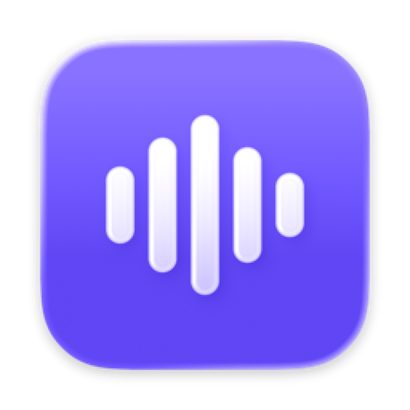

<p align="center">
  
</p>

<h1 align="center">Hush</h1>

<p align="center">
  A tiny macOS menu bar app that keeps your audio setup the way you want it.
</p>

<p align="center">
  <a href="https://github.com/laurenschristian/hush/releases/latest"></a>
  <a href="https://github.com/laurenschristian/hush/actions/workflows/build.yml"></a>
  
  
  <a href="LICENSE"></a>
</p>

## Overview

macOS has a few audio habits that get in the way. The play key opens Apple Music. AirPods take over the mic and drop to call quality audio. Music keeps playing when a call starts.

Hush fixes these from the menu bar. It reacts to system audio events as they happen, so it does not poll the device list, and it has no settings window and no network access.

## Features

**Play key**
- Stops Apple Music from launching when you press play
- Opens your last used player instead, Spotify or SoundCloud, and starts Spotify playback
- Shows the current Spotify track in the menu bar

**Mic**
- Never uses a Bluetooth mic. When AirPods take the mic, Hush moves it back to the Studio Display or MacBook mic, so AirPods keep full quality audio.
- `⌃⌥M` mutes or unmutes every mic. The menu bar icon turns red while muted.

**Output**
- Switches to headphones when they connect, and back to the speakers when they disconnect
- Pauses Spotify when headphones disconnect, so music does not jump to the speakers
- Remembers the volume for each output device

**Calls**
- Pauses Spotify when a Teams, Zoom, FaceTime, Slack, Discord, Webex, or browser call starts, and resumes it after the call

Every feature has an on/off switch in the menu.

## Performance

Measured on macOS 26.3, Apple Silicon:

| Metric | Hush 0.4.0 |
| --- | --- |
| Memory footprint | 9 MB |
| Idle CPU | 0% |
| Idle wakeups | 0 |
| App bundle size | 1.9 MB (352 KB binary) |

## Requirements

- macOS 14 Sonoma or later
- Spotify, for playback control and now playing

## Installation

### Homebrew (recommended)

```sh
brew install --cask laurenschristian/tap/hush
xattr -dr com.apple.quarantine /Applications/Hush.app
```

Hush is not notarized, so the second command is needed before the first launch.

### Manual download

Download `Hush-vX.Y.Z.zip` from the [latest release](https://github.com/laurenschristian/hush/releases/latest), unzip it, and move `Hush.app` to `/Applications`. Then run the `xattr` command above.

### Build from source

Requires the Xcode command line tools.

```sh
git clone https://github.com/laurenschristian/hush.git
cd hush
./build.sh install
```

## Usage

Click the Hush icon in the menu bar to see the current mic and output, and to turn features on or off. Turn on **Launch at login** once after install.

The first time Hush tells Spotify to play, macOS asks for Automation permission. Click **Allow**.

| Menu item | What it does |
| --- | --- |
| Block Apple Music | Quits Apple Music as soon as it starts |
| Open instead | Last used, Spotify, SoundCloud, or nothing |
| Mute mic `⌃⌥M` | Mutes every input device |
| Never use Bluetooth mic | Moves the mic off AirPods and other Bluetooth devices |
| Switch output to headphones | Follows headphones on connect and disconnect |
| Pause when headphones disconnect | Pauses Spotify |
| Remember volume per device | Restores each output's last volume |
| Pause music during calls | Pauses Spotify for the length of a call |

## Documentation

- [How it works](docs/how-it-works.md)
- [Troubleshooting](docs/troubleshooting.md)
- [Changelog](CHANGELOG.md)
- [Contributing](CONTRIBUTING.md)
- [Security](SECURITY.md)

## Limitations

- Browsers do not tell other apps which tab plays audio. Any browser audio counts as SoundCloud for **Last used**, and any browser mic use counts as a call.
- Now playing, pause on disconnect, and call mode control Spotify only. macOS does not give third party apps the system Now Playing data.

## License

[MIT](LICENSE)
